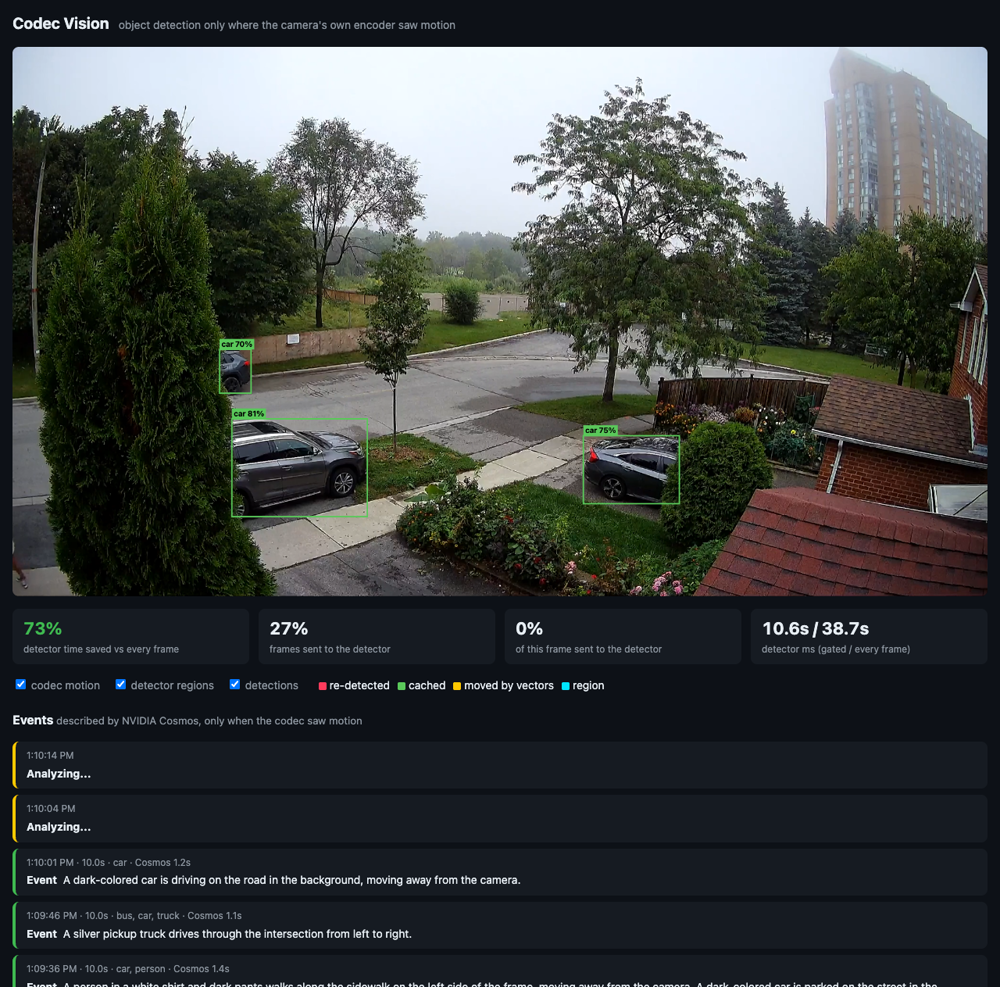
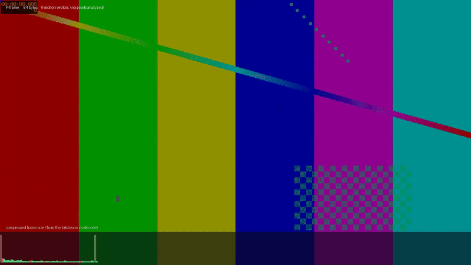

# Codec Vision

Built at the [Real-Time Video Agents Hack](https://tokensand.com/vastsf) with VAST, NVIDIA Cosmos, Cursor,
CoreWeave and Weights & Biases.

**Run AI on security cameras only when something happens, using motion the camera's own video
encoder already computed.**



## The problem

Most cameras can't run AI on-device, so they upload video and a server runs detection on every
frame. But most security cameras are static: a driveway, a loading dock, a hallway. Nearly every
frame looks like the last one, and every-frame detection mostly pays a GPU to look at nothing.

## The idea

The camera already did the work. To compress video, an H.264 encoder estimates motion for every
16x16 block and only spends bits where the picture changed. Those motion vectors and frame sizes
ride along in the bitstream for free. We read them while decoding and use them to decide when the
detector and the vision model are worth running.



## Pipeline

```
camera (H.264) --MoQ--> relay --> worker -----------------------> cam-ai/detections (YOLO boxes, per frame)
                          |        |  decode, read motion vectors
                          |        |  motion? -> YOLO11 on the frame, else reuse cached boxes
                          |        |  motion on an object for 1s+ -> event
                          |        +--> NVIDIA Cosmos3-Reason (CoreWeave) --> cam-ai/events (descriptions)
                          |        +--> VAST VSS upload (only motion events get indexed and searchable)
                          |        +--> W&B Weave traces every Cosmos call
                          +--> browser: <moq-watch> plays the video, overlays detections in sync
```

- **Transport:** [MoQ](https://moq.dev) (Media over QUIC). The camera publishes once; the video,
  the detections and the events are separate tracks that any number of viewers or agents subscribe
  to. An agent can follow the tiny `events` track without ever pulling video.
- **Codec view:** the worker also renders every motion vector the encoder produced (faint), the
  motion that counted (bright, with arrows) and the YOLO boxes into its own video broadcast,
  `<camera>-codec`, encoded with moq's native encoder. It's in sync by construction, plays in any MoQ
  player, and is only rendered while someone subscribes.
- **Detections are data, not burned-in pixels.** Each `detections` frame carries the timestamp of
  the video frame it belongs to, so the viewer draws boxes in sync with what is on screen.

## Results

Every-frame YOLO11 versus motion gating, on footage from the VAST corpus (`eval.py`, logged to
[W&B](https://wandb.ai/kixel-corp/vast)). Recall is measured against every-frame detection.

| Camera | Frames sent to detector | Detector time saved | Recall |
|---|---|---|---|
| Neighborhood street, day | 27% | **75%** | 100% |
| Neighborhood street, night IR | 63% | 44% | 100% |
| SF street corner (busy) | 98% | 21% | 100% |
| Warehouse with robots (busy) | 96-100% | 16% | 100% |
| I-24 highway (constant traffic) | 100% | 13-15% | 100% |

Quiet cameras are where this pays off, and quiet is what most security cameras are. Busy scenes
always have motion, so gating saves little there.

The live demo uses the same rule: YOLO on every frame the codec says moved, nothing else. On top
of that, a camera's AI runs only while someone subscribes to its `detections` track. If the laptop
falls behind real time and has to skip frames, those count as full cost, never as savings.

Cosmos only runs on events: about 4 per 40 seconds of the neighborhood clip, at about 1.2s each,
instead of describing every chunk of footage.

## What didn't work (yet)

- **Region-only detection.** Sending only the moving regions to YOLO cut pixels to 3-40%, but on a
  laptop GPU the fixed cost per detector call dominates, so it was slower, and boxes cut at crop
  edges cost recall. It should pay off on a server batching crops from many cameras into one GPU
  call; `--mode region` keeps the experiment.
- **Moving cameras** (dashcams, drones) move every block. Subtracting the camera's own motion from
  the vector field first is the next step.
- **HEVC:** FFmpeg exports no motion vectors for H.265, so those cameras need re-encoding or a
  frame-size-only signal.
- **Noise:** on flat, noisy areas the encoder matches sensor noise with tiny vectors; we ignore
  motion under 2.5 px per frame and clusters under 8 blocks.

## Run it

Everything runs locally on a laptop (tested on an M-series Mac).

```sh
uv venv && uv pip install -r requirements.txt     # plus moq and moq-relay on PATH
./demo.sh                                         # relay + 4 looping cameras + worker + viewer
                                                  # open http://localhost:8077 in Chrome
```

- `./prep.sh <dir> footage` re-encodes clips the way a simple camera sends them (H.264, no B-frames).
- Put `GPU_BEARER_TOKEN` (Cosmos endpoint) and `WANDB_API_KEY` in a git-ignored `.env`.
- `python worker.py --save-events` writes described event clips to `events/`, and
  `VSS_USERNAME=... python upload.py --watch` pushes them into VAST VSS for search.

## Footage

The demo clips come from the VAST Builders Challenge corpus and aren't redistributed here. With
access to a team's VSS instance, download these chunks from its Explore page (or run
`VSS_USERNAME=team-47 python fetch.py --list`, then e.g. `python fetch.py neighborhood_20260901:0-7` to join consecutive chunks into one long clip), then re-encode them the way a simple camera sends video:

| Camera | Source chunk |
|---|---|
| `driveway` | `neighborhood_20260901_chunk_0007.mp4` |
| `night` | `neighborhood_20260902_chunk_0021.mp4` |
| `warehouse` | `2025_test_Warehouse_017_Camera_01_chunk_0007.mp4` |
| `street` | `sf4_chunk_0009.mp4` (HEVC; `prep.sh` converts it to H.264) |

```sh
./prep.sh ~/Downloads/vss footage     # H.264, no B-frames, 2s GOP
```

No corpus access? `./scene.sh footage/scene.mp4` builds a synthetic camera from the sample images
Ultralytics ships, and `./camera.sh footage/scene.mp4 cam` streams it.

## Scripts

| Script | What it does |
|---|---|
| `worker.py` | Live: subscribe over MoQ, gate YOLO on codec motion, publish detections and events |
| `engine.py` | Motion grid from codec vectors, detection cache, the every/frame/region modes |
| `codecview.py` | Renders the codec view frame: all vectors, counted motion, boxes |
| `agent.py` | Groups motion into events, describes them with Cosmos (traced in Weave) |
| `web/index.html` | Viewer: MoQ player, synced overlay, cost panel, event feed |
| `eval.py` | Offline: every-frame vs. gated on the same frames; time, recall, precision |
| `wandb_log.py`, `summary.py` | Push eval results to W&B; print the table |
| `score.py` | Per-segment "% static" for a folder or S3 prefix, codec data only |
| `extract.py`, `render.py` | Dump and draw raw motion vectors and frame sizes |
| `upload.py`, `fetch.py` | Push event clips into VAST VSS; pull clips and their stored detections |

## How motion is scored

For each P-frame, a 16x16 block counts as changed if its motion vector moves at least 2.5 px, or if
it has no vector at all (intra-coded: new content). Motion counts when one connected cluster of
changed blocks reaches 8 blocks, because noisy sensors make the encoder intra-code scattered single
blocks. Keyframes carry no vectors, so they always run the full detector and resync the cache.
